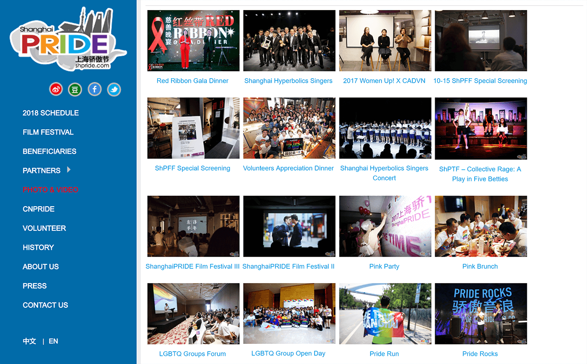
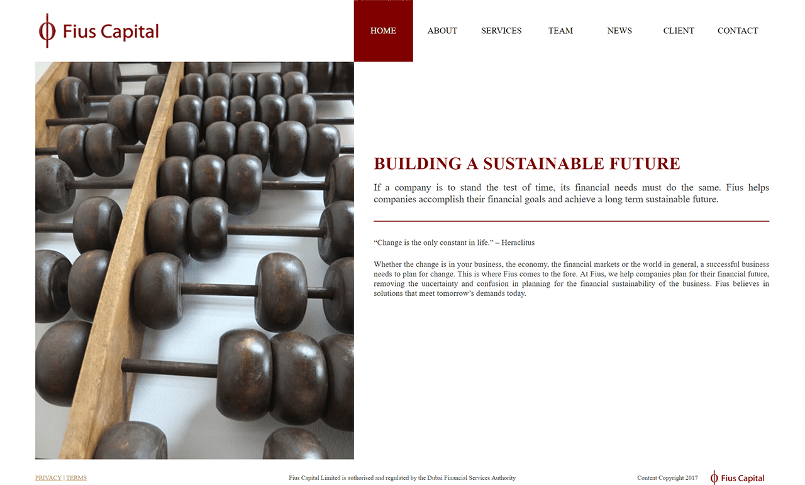
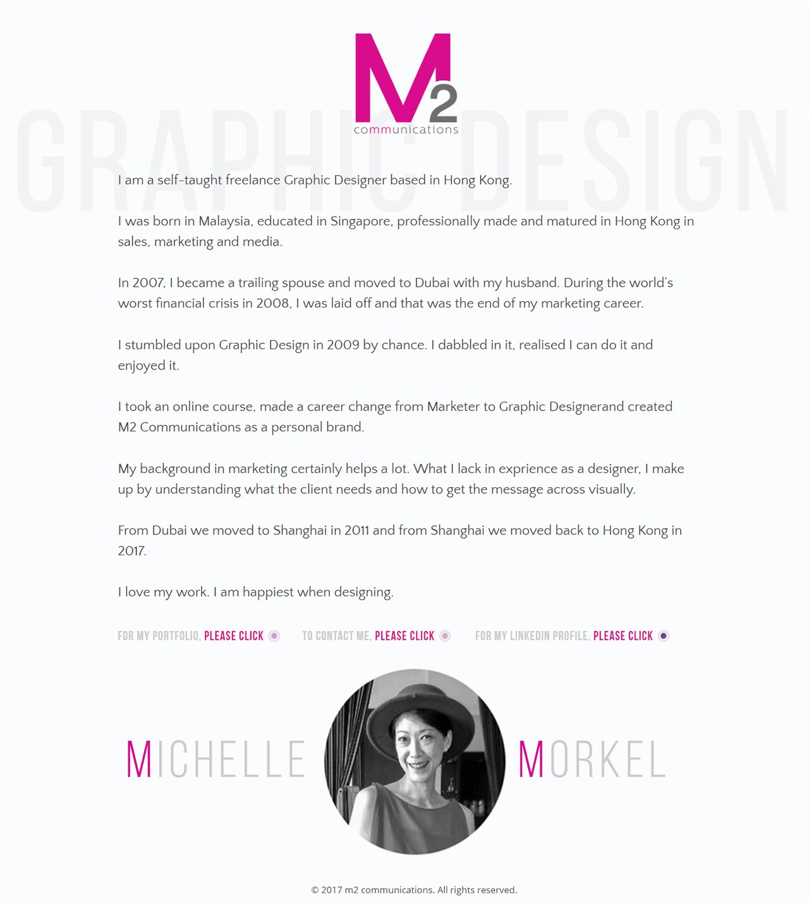

# Ethan J. Li

I am an efficient Shopify & WordPress Developer based in Montreal, Canada. I enjoy working on challenging projects and finishing work faster than I quoted.

I have a lot of experience in communicating technical ideas with non-technical people. I am good at spotting potential miscommunications between developers & non-developers. I tend to ask many questions before taking a job, such that I am on the same page with the clients in terms of what they want.

For my day job, I work as a C++ Software Developer on video games and game engines. I enjoy digging into complex systems and tackle difficult problems.

### Projects (in chronological order)

#### ShanghaiPRIDE - [shpride.com](http://www.shpride.com/)

#### Fius Capital - [fiuscapital.com](http://www.fiuscapital.com/)

#### Purple 9 Wine

#### Royal Asiatic Society China in Shanghai - [royalasiaticsociety.org.cn](http://www.royalasiaticsociety.org.cn/)

#### Paul Cheung Chiropractic - [paulbackguru.com](http://www.paulbackguru.com/)

#### M2 Communications Graphic Design - [m2communications.me]( http://m2communications.me/)

